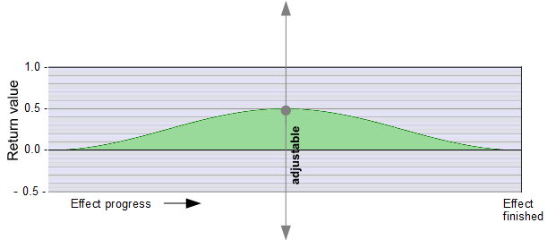

# progressCos0_Y_0  
  
### Three-point progress: 0 ...  adjustable central value  ... 0  
  
  ---
    
### Required global variable declaration and definition 
*(add outside and above all shaders and functions):*
```` Code
//--------------------------------------------------------------//
// Definitions, declarations und macros
//--------------------------------------------------------------//

#define TWO_PI  6.2831853072
float _Progress;
````
---
  
### Code (Example as a function):  
```` Code
float fn_progressCos0_Y_0 (float centralValue)
{
   return 
      (cos(_Progress * TWO_PI) * -0.5 + 0.5) 
      * centralValue;
}
````
---
  
### Parameter Description:
    
1. `_Progress`
   Auto-synced parameter
   - **Type:** `float`, global  
   - **Value range:** 0.0 to 1.0
   - [Documentation of the variable `_Progress`](_Progress.md)  
   
2. **TWO_PI**: Defines the wavelength as one complete wave.  
   Higher values shorten the wavelength (more waves per effect runtime)  
   
3. `*-0.5` Scales the cos return values (+1 .. -1 ... +1) to -0.5 .. +0.5 .. -0.5  

4. `+ 0.5` Moves the wave in the positive range to to 0 .. +1 .. 0

5. `centralValue`:  
   The adjustable central value.  
   This defines the return value at 50% effect progress  (`_Progress = 0.5`).  
   - **Type:** `float`, local   
   - **Permissible value range:** Unlimited, positive and negative. 
   
---
  
## Return value:
   - If `_Progress = 0.0`: 0.0  
   - If `_Progress = 0.5`: identical to `centralValue` (unlimited, positive and negative)  
   - If `_Progress = 1.0`: 0.0
   - The return values between the three Progress points (0.0 and 0.5 and 1.0) are calculated by the cosine wave.
   - **Type:** `float`   
   - **Value range:** Unlimited, positive and negative.  


