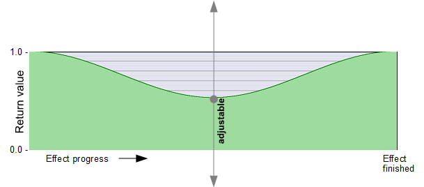

# progressCos1_Y_1  
  
### Three-point progress: 1 ...  adjustable central value  ... 1  
  
  ---
    
### Required global variable declaration and definition 
*(add outside and above all shaders and functions):*
```` Code
//--------------------------------------------------------------//
// Definitions, declarations und macros
//--------------------------------------------------------------//

#define TWO_PI  6.2831853072
float _Progress;
````
---
  
### Code (Example as a function):  
```` Code
float fn_progressCos1_Y_1 (float centralValue)
{
   float progressCos1_0_1 = cos(_Progress * TWO_PI) * 0.5 + 0.5;
   return progressCos1_0_1 * (1.0 - centralValue) + centralValue;
}
````
---
  
### Parameter Description:
  
1. `centralValue`:  
   The adjustable central value.  
   This defines the return value at 50% effect progress  (`_Progress = 0.5`).  
    see also ["Return value"](#return-value)
   - **Type:** `float`, local   
   - **Permissible value range:** Unlimited, positive and negative.  
   
2. `_Progress`
   Auto-synced parameter
   - **Type:** `float`, global  
   - **Value range:** 0.0 to 1.0
   - **Alternative:** Often, it may be better to use another variable instead of `float _Progress`,  
      whose ramp is [generated by keyframing.](../../Basics/Variables_etc/Auto_synced/_Progress.md)
  
---
  
## Return value:
   - If `_Progress == 0.0` then 1.0  
   - If `_Progress == 0.5`then identical to `centralValue` (unlimited, positive and negative)  
      Other control behavior see the alternative code `progressCos1_Yb_1` below.
   - If `_Progress == 1.0` then 1.0  
   - The return values between the three Progress points (0.0 and 0.5 and 1.0) are calculated by the cosine wave.
   - **Type:** `float`   
   - **Value range:** Unlimited, positive and negative.  

---
---

## Alternatives:

### Local code in the shader instead of the function:  
If you need a settable and in addition a fixed progress curve in a single shader, then one of these variants could be useful:

#### Two progress curves available `progressCos1_0_1` and `progressCos1_Y_1`:
```` Code
float progressCos1_0_1 = cos(_Progress * TWO_PI) * 0.5 + 0.5;
float progressCos1_Y_1 = progressCos1_0_1 * (1.0 - centralValue) + centralValue;
````
  
  or
  
#### Two progress curves available `progressCos0_1_0` and `progressCos1_Y_1`:

```` Code
   float progressCos0_1_0 = cos(_Progress * TWO_PI) *-0.5 + 0.5;
   float progressCos1_Y_1 = 1.0 - progressCos0_1_0 * (1.0 - centralValue);
````

---

## progressCos1_Yb_1
#### Alternative control behavior of parameter `centralValue`:

```` Code
   float progressCos0_1_0 = cos(_Progress * TWO_PI) *-0.5 + 0.5;
   float progressCos1_Yb_1 = 1.0 - progressCos0_1_0 * centralValue;
````

#### Return value of `progressCos1_Yb_1` (deviating from `progressCos1_Y_1`):
   - If `_Progress == 0.0` then 1.0  
   - If `_Progress == 0.5` and   
      - If `centralValue` < 0.0  then Return values over 1  
      - If `centralValue` == 0.0 then 1.0  
      - If `centralValue` == 0.5 then 0.5 
      - If `centralValue` == 1.0 then 0.0  
      - If `centralValue` > 1.0  then negative values  
   - If `_Progress == 1.0` then 1.0  
   - The return values between the three Progress points (0.0 and 0.5 and 1.0) are calculated by the cosine wave.
   - **Type:** `float`   
   - **Value range:** Unlimited, positive and negative.  
