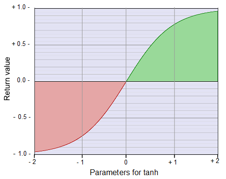

# tanh ()

See **page 759** in the PDF document: [Nvidia's Cg reference manual](https://www.google.com.au/url?sa=t&rct=j&q=&esrc=s&source=web&cd=3&cad=rja&uact=8&ved=0ahUKEwj5qpif6rHTAhXLF5QKHQ6MCeAQFggwMAI&url=http%3A%2F%2Fdeveloper.download.nvidia.com%2Fcg%2FCg_3.1%2FCg-3.1_April2012_ReferenceManual.pdf&usg=AFQjCNHI5gaVpuvJH6ZO8bnX7BxJGKXr0A)

  - #### Mathematical basics: https://en.wikipedia.org/wiki/Hyperbolic_function#Tanh  
  
  - #### Example of return values of tanh when using a ramp from -2 to +2 for the parameter:  
   

  - #### [Video](video/tanh.mp4?raw=true) of the tanh return characteristic with different linear parameter ramps.  
  - #### This code was used for the test:
     Function:
     ```` Code
     float fn_test (float ramp)
     {                
        ramp = (ramp * 2.0 - 1.0);    // Ramp -1 to + 1
        ramp *= TestValue;            // Range of the ramp ("TestValue" is the value of the slider in the video) 
        if (Mode == 0) return ramp;   // Values of the ramp, if this effect mode was selected.
        return tanh (ramp);           // Values of the tanh, if this effect mode was selected.
     }
     ````
     
     Function call in the shader:
     ```` Code
     fn_test (xy.x);     // Parameter xy.x corresponds to a ramp from 0 to 1
     ````
     
  ---
  ---
     
## Critical parameter values:
     
If the parameter values are too high, mathematical inaccuracies can lead to unexpected return values.
Some sample videos (tested with Windows, GPU:Intel HD Graphics 4600):

   - In this example, if the parameter exceeds the value + -87, the return value unexpectedly jumps to 0:
   **[Video](video/cirtic_values1.mp4?raw=true)**  
     
   - With other code, the behavior can be completely different.  
     In this example, the ramp was not generated with the texture coordinates xy.x,  
     but with the Auto-synced parameter `_Progress`.  
          Function call in the shader:
     ```` Code
     fn_test (_Progress);     // Relative effect position, Range 0 to 1
     ````
     From this, we created a parameter range from -1 to +1 in the function, as in the previous test.
     In this case, incorrect return values occurred at parameter values of about 700.  
     These incorrect return values do not return the value 0, but high negative values.  
        **[Video with bar graph of the return values](video/cirtic_values2.mp4?raw=true)**
