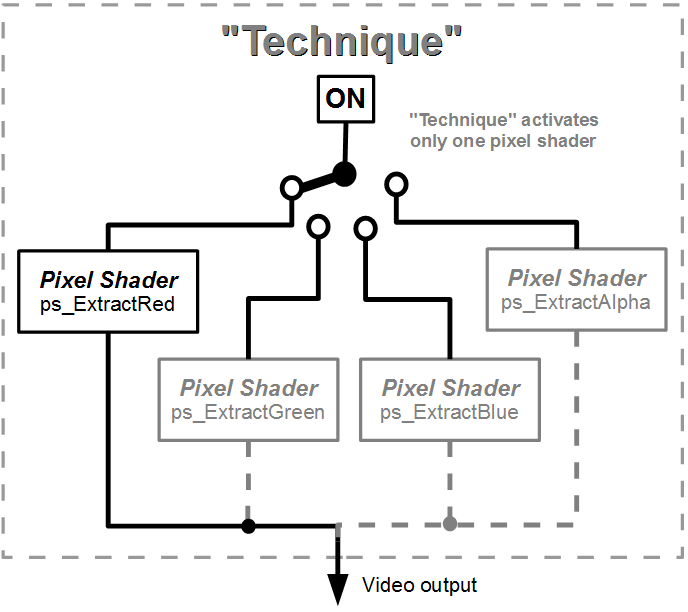

# Multi technique

We can allow the user to switch between pixel shaders.  
This simplified graph shows the "Channel Extractor" effect:  


For each Pixel Shader, we can program a "Technique" that activates a selected Pixel Shader.
``` Code
technique Red
{
   pass P_1
   {
      PixelShader = compile PROFILE ps_ExtractRed();
   }
}

technique Green
{
   pass P_1
   {
      PixelShader = compile PROFILE ps_ExtractGreen();
   }
}

technique Blue
{
   pass P_1
   {
      PixelShader = compile PROFILE ps_ExtractBlue();
   }
}

technique Alpha
{
   pass P_1
   {
      PixelShader = compile PROFILE ps_ExtractAlpha();
   }
}
```

For the selection of Technique the order in the code is decisive.
This must correspond to the [user settings](../UserSettings/Select_Technique.md ).

 The name of the Technique is not important.
 A suitable name is of course meaningful.
 The same rules apply to the naming as are used for variable names.
 Avoid identical names with eg variables etc.

 Differing from the original "Channel Extractor" code, I made adjustments according to our template:
•Pass rename to "pass_one"
•Shader names have been added to the prefix "ps_".


 If many Techniques are used, I prefer to write the code compact:


technique Red   {pass _1  {PixelShader = compile PROFILE ps_ExtractRed();   }}
technique Green {pass _1  {PixelShader = compile PROFILE ps_ExtractGreen(); }}
technique Blue  {pass _1  {PixelShader = compile PROFILE ps_ExtractBlue();  }}
technique Alpha {pass _1  {PixelShader = compile PROFILE ps_ExtractAlpha(); }}


 I replaced the name "pass_one" with "_1".
 The name is unimportant, and can be used multiple times in the code.
 The same rules apply to the naming as are used for variable names.
 (The pass-name can not start with a number)
 Because each of these techniques uses only one pass, names like "SinglePass", "pass_one" or "_1" are useful.


 At the end of the line we see which pixel shader is activated by the respective technique. This name must match the name of the corresponding pixel shader.
