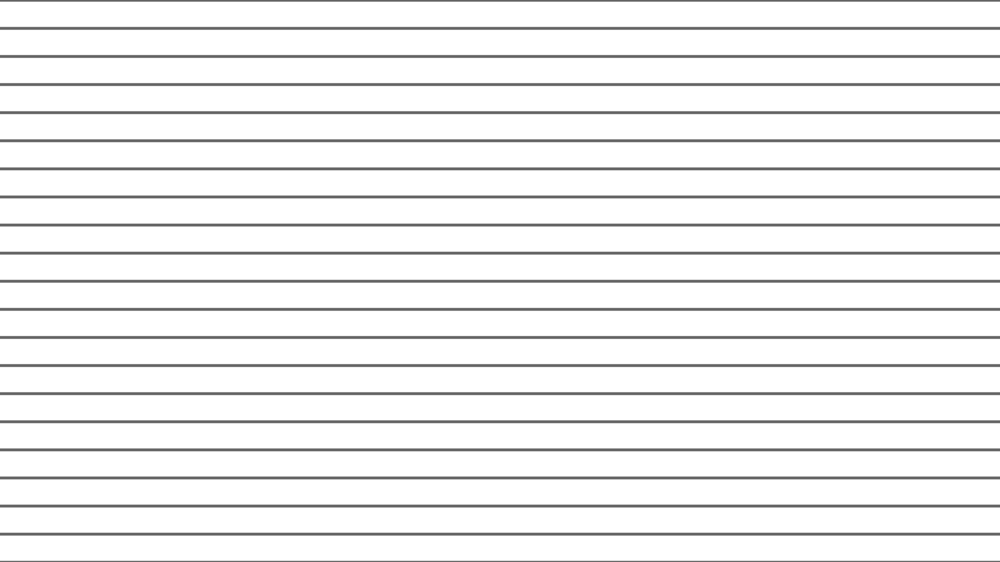

# multilines_total_X                         [](images/multilines_total_X.png)

**Function call:** `fn_multilines_total_X (uv, color , bgVariable , lines , half_Lineweight , roll)`   
or  
**Macro call:** `MULTILINES_TOTAL_X (uv, color , bgVariable , lines , half_Lineweight , roll)`  
  ([Macro code](#macro-code) can be found at the bottom of this page)
  
--- 
  
***Purpose of the macro:***  
Generating a selectable number of **horizontal lines** of equal distance across the **entire frame**.  
The **background texture** is added with the `bgVariable`.  
This can be a color, or a texture from a sampler.  
The macro itself performs something similar to **pixel interpolation on the edges of the lines**.  
(1 subtexel vertical edge softness of the lines)  
More functions and details see the parameter descriptions.  

---


### Environment requirements

#### Global variable:  `float _OutputHeight`

#### Code (Example as a function):
```` Code
float4 fn_multilines_total_X (float2 uv, float4 color, float4 bgVariable, 
                              float lines, float half_Lineweight, float roll)
{ 
   float mix = saturate (
      (abs( (uv.y - roll) - (round( (uv.y - roll)  * lines)  / lines ))
      - half_Lineweight
      ) /  (1.0 / _OutputHeight)
   );
  
   return lerp (color, bgVariable, mix);
}
````   
`(1.0 / _OutputHeight)` is the height of a texel within the output texture.  
This creates the necessary edge softness of the lines.

The use of `_OutputHeight` is controversial because in interlaced projects this variable has a different value during playback than when playback is stopped.  
In this macro, this means that while the playbacks in interlaced projects, the edge softness of the lines is doubled. This may be desirable in the case of very narrow lines, because otherwise the position-dependent variations line width will be visible by one pixel. In the case of moving line positions using keyframing, this also minimizes the flickering of the lines in interlaced projects.  
If you do not want more edge smoothness of the lines in interlaced projects, then you can use instead:  
`(1.0 / (_OutputWidth/_OutputAspectRatio))`. (Remember to declare these global variables high up in the code, outside the function.)

---
---

#### Parameter Description  
  
   1. `uv`:  
     Enter the name of the used texture coordinate variable.  
     **Type: `float2`**  
     Recommendation: float2 uv0 : TEXCOORD0   (which may not be used for sampler parameters!)


---

  
   2. `color`:  
     Color of the line  
     **Type: float4 (RGBA)**  
        - The **macro code** also works with other float types (eg float3 RGB).  
          In any case, it must be the same type as `bgVariable`

  
---

   3. `bgVariable`:  
     The background texture  
     **Type: float4 (RGBA)**  
        - The **macro code** also works with other float types (eg float3 RGB).  
          In any case, it must be the same type as `color`  

       
---

   4. `lines`:  
     Number of lines  
     **Type: scalar `float`**  
     **Impermissible value:** 0 (would be a division by zero within the macro)

---

   5. `half_Lineweight`:  
     Half line width  
     **Type: scalar `float`**  
       - Usable value range 0.0 to 0.5  
       - Examples:  
         0.0:  Line thickness 1 to 2 pixels  (line thickness + 2 * edge softness)  
         0.005: Line thickness 1% of the frame hight  
         0.5:  Line thickness over the entire frame height  
         
---
   
   6. `roll`:  
     - Roll the lines along the Y axi.  
     - Rising values of `roll` roll all lines down, sinking values up.
     - **Type: scalar `float`**  
     - Usable value ranges:  
       - To position the first line within the texture: from 0 to 1  
       - Rolling of the lines (keyframing): ~ -1000 to + 1000  
         (if this range is exceeded, the mathematical unrealities can be seen.)  
     - Position of the first line (which is the only one independent of the number of lines): 
       - Value 0.0: The center of this line thickness is at the top  edge of the frame. (half of the line is outside the texture)   
       - Value 0.5: This line is centered in the frame.  
       - Value 1.0: Like value 0, (wrapped)  


---

 #### Return value:
   - The value of the parameter `color` (the line)  
     - or the value of the parameter`bgVariable`  
     - or a mix of both (edge-interpolatin of the lines)  
   - **Type: same as `color` and `bgVariable`**    
   - Value range: 0.0 to 1.0  

 
---
---

### Macro code:

```` Code
#define MULTILINES_TOTAL_X(uv,color,bgVariable,lines,half_Lineweight,roll)              \
   lerp ((color), (bgVariable), saturate (                                              \
         (abs( ((uv).y - (roll)) - (round( ((uv).y - (roll))  * (lines))  / (lines) ))  \
         - (half_Lineweight)                                                            \
         ) /  (1.0 / _OutputHeight)                                                     \
   ))
````  

### Screenshot  

