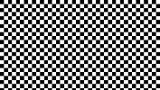
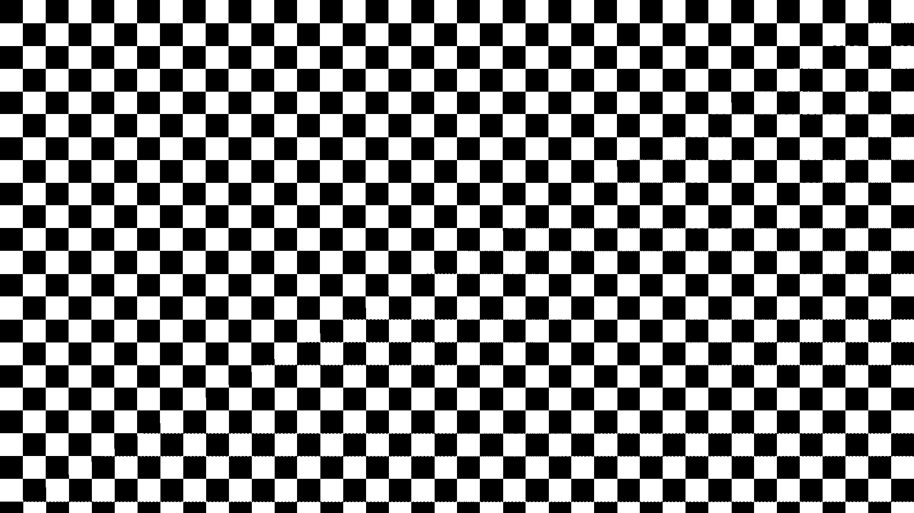

# checkPattern  [](../images/checkPattern.png)

**Function call:** `fn_checkPattern (uv, color1, color2, numberH);`  

Example with values: `fn_checkPattern (uv, 0.0.xxx, 1.0.xxx, 20.0);`  
(Result [see image](../images/checkPattern.png))  Note that the quality may depend on the texture coordinates used.  
In this screenshot this problem has been made visible for demonstration purposes.  
For further details see parameter description `uv` . 
  
--- 
  
***Purpose:***  
Generating a selectable number of squares with changing color or brightness or other RGB source.    
This can be a color, or a texture from a sampler.    
More details see the parameter descriptions.  

---
    
#### Required global definitions and declarations:
*(add outside and above all shaders and functions):*
```` Code
//-----------------------------------------------------------------------------------------//
// Definitions and declarations
//-----------------------------------------------------------------------------------------//

float _OutputAspectRatio;
````

---


#### Code (Example as a float3 RGB function without alpha):
```` Code
float3 fn_checkPattern  (float2 uv, float3 color1, float3 color2, float numberH)
{ 
   float x =  round (frac (uv.x * numberH ));
   float y =  frac (uv.y * (numberH / _OutputAspectRatio) );
   x = (y >= 0.5) ? x : 1.0 - x;
   return lerp (color2, color1, x);
}
````   
When making code changes, note that `color1` and `color2` must have the same float type.

**Description in illustrated form:**  
(Where one-dimensional float values are created in the code, 
the images linked below show these values as grayscale (for illustration purposes only).

`float x = round (frac (uv.x * numberH ));` [creates vertical lines](img/03.png)  
   - `frac (uv.x)` [creates these](img/01.png)  
   - `frac (uv.x * numberH )` [this is the result](img/02.png) *(if `numberH` = 5.0)*  
   
`float y =  frac (uv.y * (numberH / _OutputAspectRatio) );` [creates these](img/11.png)  
`x = (y >= 0.5) ? x : 1.0 - x;` combines `x` and `y` to a [pattern](img/21.png)  
 `return lerp (color2, color1, x);`Assigns the value of `x` to one of the two [colors.](img/31.png)  


---
---

#### Parameter Description  
  
   1. `uv`:  
     Enter the name of the used texture coordinate variable.  
     **Type: `float2`**  
     When using uncleaned texture coordinates based on TEXCOORD0, 
     there may be small dots on the edges of the squares (Windows based operating systems).  
     This is not the case when using texture coordinates which refer to an input, 
     but this requires that something is always connected to this input.
     Alternatively you can use the code [checkPatternSoft](checkPatternSoft.md).
     Due to the integrated edge softness, 
     the alternative code also gives you clean edges with TEXCOORD0 based coordinates.
      

---

  
   2. `color1`:  
     Color of the first square at the top left. 
     **Type: `float3` (RGB)**  
       - This can be a color, or a texture from a sampler.

  
---

   3. `color2`:  
     Color of the squares next to `color1` squares. 
     **Type: `float3` (RGB)**  
       - This can be a color, or a texture from a sampler.  

       
---

   4. `numberH`:  
     Number of squares of the same color in a horizontal line.  
     **Type: `float`**  


---

#### Return value:
   - The value of the parameter `color1` or `color2` (in the change of squares) 
   - **Type: float3** (same type as `color1` and `color2`)    
   - Value range: 0.0 to 1.0  

 
---
---


### Screenshot  

