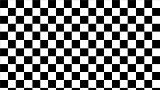

# ´´´´´´´in Arbeit --------------

# checkPatternSoft  [](../images/checkPatternSoft.png)

**Function call:** `fn_checkPatternSoft (uv, color1, color2, numberH, edgeSharpness);`  

Example with values: `fn_checkPatternSoft (uv, 0.0.xxx, 1.0.xxx, 20.0, 1000.0);`
(Result [see image]../images/checkPatternSoft.png))
  
--- 
  
***Purpose:***  
Generating a selectable number of of squares with changing color or brightness or other RGB source.    
This can be a color, or a texture from a sampler. 
Adjustable edge softness of the squares.   
More details see the parameter descriptions.  

---
    
### Required global definitions and declarations:
*(add outside and above all shaders and functions):*
```` Code
//-----------------------------------------------------------------------------------------//
// Definitions and declarations
//-----------------------------------------------------------------------------------------//

float _OutputAspectRatio;
#define PI  3.141592654
````
---

#### Code (Example as a float3 RGB function without alpha):
```` Code
float3 fn_checkPatternSoft  (float2 uv, float3 color1, float3 color2, float2 numberH, float edgeSharpness)
{ 
   numberH.y /= _OutputAspectRatio;
   float2 mix =  sin (uv * PI * numberH ) * edgeSharpness / numberH;
   mix =  clamp( mix, -0.5, 0.5) + 0.5; 
   mix.x = lerp( mix.y , 1.0 - mix.y, mix.x);
   return lerp (color1, color2, mix.x);
}
````   
When making code changes, note that `color1` and `color2` must have the same float type.

Code description at the bottom of this page.


---
---

#### Parameter Description  
  
   1. `uv`:  
     Enter the name of the used texture coordinate variable.  
     **Type: `float2`**  
      

---

  
   2. `color1`:  
     Color of the first square at the top left. 
     **Type: `float3` (RGB)**  
       - This can be a color, or a texture from a sampler.

  
---

   3. `color2`:  
     Color of the squares next to `color1` squares. 
     **Type: `float3` (RGB)**  
       - This can be a color, or a texture from a sampler.  

       
---

   4. `numberH`:  
     Number of squares in a horizontal line.  
     **Type: `float`**  


---

 #### Return value:
   - The value of the parameter `color1` or `color2` (in the change of squares) 
   - **Type: float3** (same type as `color1` and `color2`)    
   - Value range: 0.0 to 1.0  

 
---
---


**Code description in illustrated form:**  
(Where one-dimensional float values are created in the code, 
the images linked below show these values as grayscale (for illustration purposes only).


---
---
### Screenshot  

