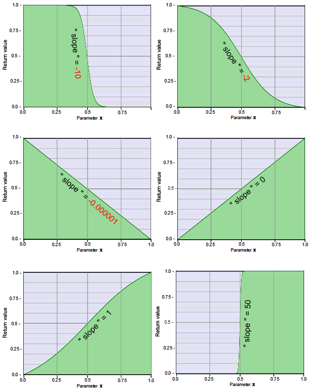

# curve12S 
and alternative code **[curve12bS](#curve12bS)**  
  
- S-curve with adjustable slope based on tanh. 
- Automatic rescaling of the TANH return values to ensure that the S-curve starts and ends with saturated levels (0 or 1)

  
  
  ---
    
### Required global definitions and declarations:
*(add outside and above all shaders and functions):*
```` Code
//--------------------------------------------------------------//
// Definitions, declarations und macros
//--------------------------------------------------------------//

#define TANH(value)    tanh (clamp ( value , - 9.0 , 9.0))
````
This definition avoids critical values. See the [documentation of tanh.](../../Basics/Functions/Cg_standard_library/tanh/README.md#critical-parameter-values)  

---
  
### Code (Example as a function):  
```` Code
float fn_curve12S (float x, float slope)
{
   slope = (slope < 0.0) ?  min(slope , -0.03) : max(slope , 0.03 );
   x = x * 2.0 - 1.0 ;

   float sCurve  = TANH ( slope * x );
   float refLevel = abs (TANH (slope));
   float levelCorrection = 1.0 / max(refLevel, 1E-9);
   sCurve *= levelCorrection;
   return sCurve / 2.0 + 0.5;
}
````
**Description:**  
   - `slope = (slope < 0.0) ?  min(slope , -0.03) : max(slope , 0.03 );`  
   Prevents too small absolute values, which could lead to inaccurate or unexpected return values.
      - Background Information: With `slope` values close to zero, the return value range of TANH would be very small. 
        In the subsequent rescaling to a saturated range, even tiny inaccuracies in the TANH calculation are increased. 
        The absolute values of at least `0.03` used here considerably reduce this problem.  
        The side effect is a slight difference of the characteristic curve from the ideal if values > -0.03 and < +0.03 are set. 
        A linear ramp was assumed as the ideal for `slope` = 0. 
        This [graph](img/inaccuracies12.png) shows the inaccuracies including a weak noise. 
        (tested with Windows and the GPU "Intel HD Graphics 4600"). 
        Noise is the mathematical inaccuracy mentioned above that has been amplified by automatic rescaling. 
        The waveform is the difference from an ideal linear ramp, 
        and is the side effect in limiting the noise to this low level, by this code.
        
   - `x = x * 2.0 - 1.0;` Rescaling of the presupposed value range (0 .. 1) to the range required for tanh from (-1 ... +1)  
   - `float sCurve  = TANH ( slope * x );` S-curve, negative and positive values.  
      Note that TANH is the macro described above.  
   - `float refLevel = abs (TANH (slope));`  
      - Functionally identical, longer code `float refLevel = abs (TANH (slope * 1.0));`
      - Reference level at the end of the curve (x = 1.0). 
   - `float levelCorrection = 1.0 / max(refLevel, 1E-9);`  
      Factor by which the S-curve must be scaled so that the respective ends result in -1 or +1.  
      `max(refLevel, 1E-9)` prevents a division by zero.
   - `sCurve *= levelCorrection;`  Rescaling the S-curve so that the value at the respective ends of the S-curve is -1 or +1.
   - `return sCurve / 2.0 + 0.5;` Rescaling the range to 0 .. 1

---
  
### Parameter Description:
    
1. `x`: The value to which the S curve is to be applied.
   - **Type:** `float`, local   
   - **Value range**: Designed for a range of **0.0 to 1.0** , but all other values are allowed.
   - **Center** of the S-curve (return value identical to `x`): **0.5**   

2. `slope`: Slope in the center of the S-curve  
      - Due to the rescaling functionality, the actual gradient can be much stronger. (see graphics above)  
        If the value is 0, the return value is [almost identical](img/inaccuracies12.png) to `x`.
      - **Type:** `float`, local   
   
---
  
### Return value: 
   - **Value range**: 0 to 1  
    In particular, note the abrupt change of the curve as soon as the set value of `slope` 
    moves into the negative range (see diagrams above).
   - **Type:** `float`
   
---
---

### Alternative code:

Under the following conditions, the macro `TANH` can alternatively be replaced by `tanh` (Macro not required):  
   The function is called with parameter values within the following range:  
   - `x` Maximum range 0 to 1  
   - `slope` Maximum range about -9 to +9  
    
If the macro`TANH` is used, these restrictions do not apply!  


